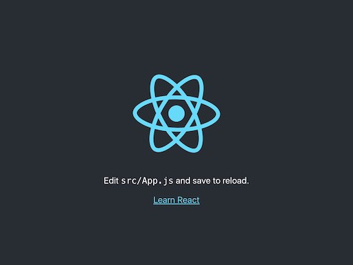

# warsawjs-workshop-25-myskills
WarsawJS Workshop #25 project - Track your skills and share your skillset report with those interested

## Uruchomienie projektu

Komenda `npm start` uruchamia serwer z projektem w trybie deweloperskim.
Otwórz [http://localhost:3000](http://localhost:3000) w przeglądarce, by zobaczyć projekt.
Strona powinna przeładowywać się automatycznie po każdym zapisie pliku.

Po poprawnym uruchomieniu zobaczysz podobny ekran:

### Lista funkcjonalności
* Wyświetlenie prostej struktury (rozgrzewka)
* * Nagłówek / Logo
* * Sekcja na treść
* * Prosta lista
* Wyświetlenie listy pytań (z danych) - pole tekstowe
* Reagowanie na zmiany zawartości pola
* Obsługa innych typów pytań
* * Liczba (np slider albo powielone ikony)
* * Wielokrotny wybór (Checkbox'y)
* * Select z wyszukiwarką (plugin [Chosen](https://github.com/harvesthq/chosen))
* Warunki dla pytań (np. w zależności od poprzedniej odpowiedzi)
* Wczytywanie listy pytań z serwera
* Walidacja wprowadzonych danych
* Generowanie / pobieranie unikalnego id dla użytkownika
* LocalStorage - odczyt i zapis odpowiedzi
* Widok pytanie po pytaniu
* Powiadomienie o aktualizacji pytań
